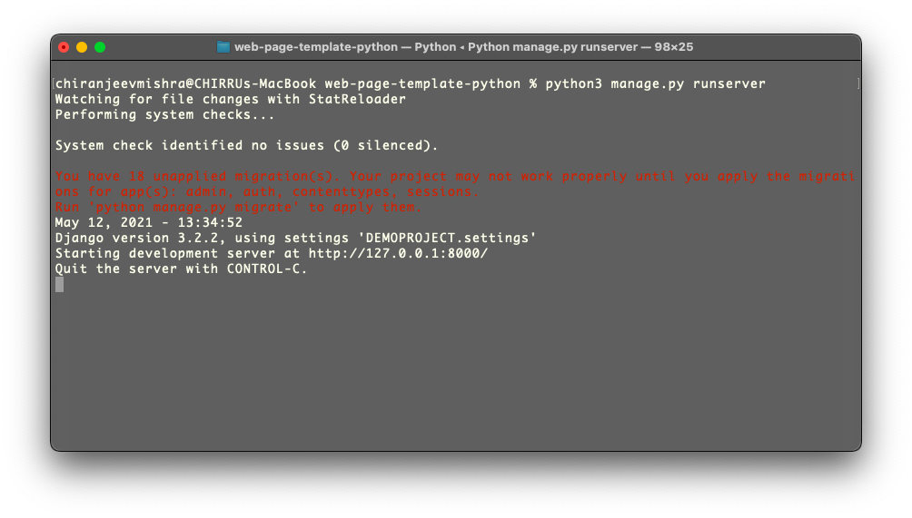

# This is a template for Web hosting using Python 

## How to use it
```bash
git clone https://github.com/chirrumishra/web-page-template-python
cd web-page-template-python
pip install requirements.txt
python3 manage.py runserver
```


## Output
# Terminal Window


# Game Window


Your basic webpage using python and django is ready to use

Source for game : https://www.w3schools.com/graphics/game_intro.asp
